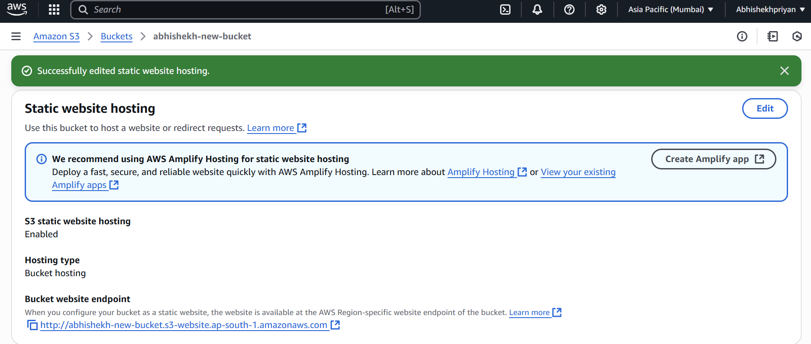
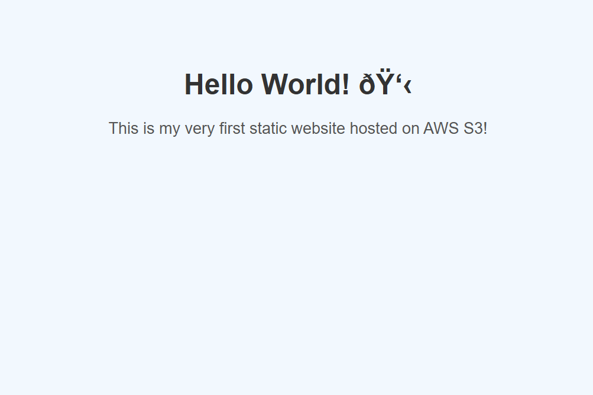

# AWS Static Website Hosting 
This is my first cloud project, where I hosted a static website using **Amazon S3**.
## What I Did
- Created an S3 bucket with public access
- Enabled static website hosting
- Uploaded a basic HTML page (`index.html`)
- Configured permissions to make the site publicly accessible
- Accessed my live website via the S3 bucket's endpoint

##  Live Demo
[Click here to view the website](http://abhishekh-new-bucket.s3-website.ap-south-1.amazonaws.com/)
## 🛠 Tech Used
- **Amazon S3** (Simple Storage Service)
- **HTML**
- **AWS Console**

## 📸 Screenshots

### AWS S3 Configuration

### Live Website

- How to host static websites on AWS S3
- IAM and S3 bucket permissions
- Using GitHub for version control and project sharing

---

